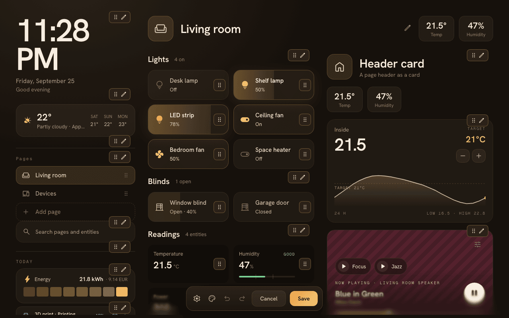
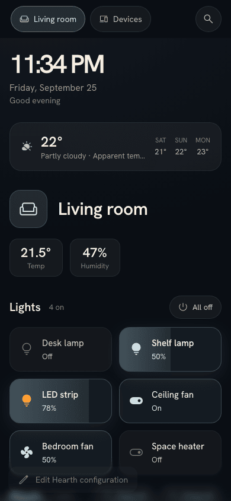
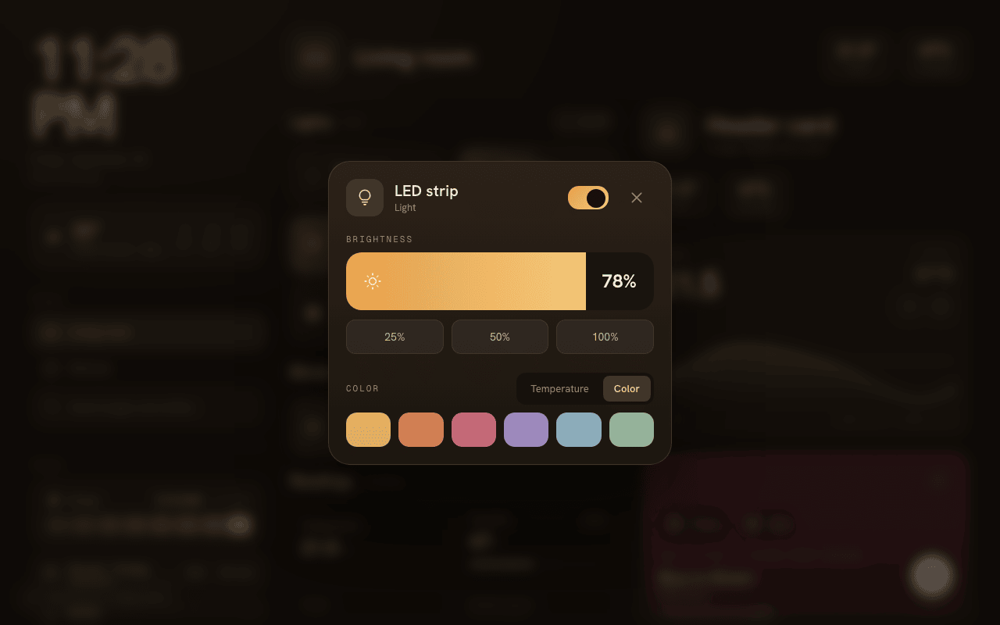
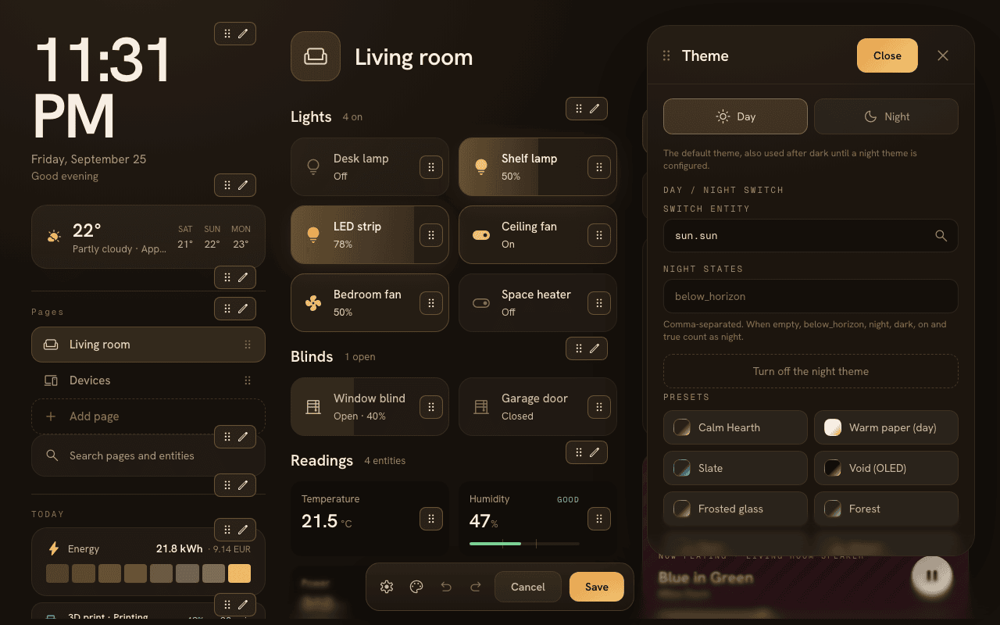

# Hearth

Hearth is a Home Assistant dashboard for wall tablets, phones and desktops. It shows your rooms, devices and daily information in a layout you arrange with a visual editor, with day and night themes that follow your home.

I built Hearth for the tablet on my wall. It started as a rework of [ha-fusion](https://github.com/matt8707/ha-fusion) and grew into its own dashboard.

Hearth is pre-1.0. The configuration format and features can still change between minor releases; breaking changes are listed in the [changelog](CHANGELOG.md).


## Features

- Visual editor: drag cards and widgets, edit them in place, undo and redo, or edit the YAML directly.
- Setup wizard that proposes a first dashboard from your Home Assistant areas, devices and entities.
- Layouts for tablets, phones and desktops, with a side rail for clocks, weather, navigation and other widgets.
- Day and night themes switched by an entity such as `sun.sun`, plus theme presets and custom CSS.
- Cards for entities, headers, sensors, climate, media, vacuums, cameras, images, scenes and more.
- Camera playback over WebRTC or HLS, with a still image as fallback.
- Search across pages and entities, and a detail sheet with state, attributes and history for any entity.

| Editor                                      | Phone                                     |
| ------------------------------------------- | ----------------------------------------- |
|         |     |
| **Light controls**                          | **Themes**                                |
|  |  |

## Install

### Home Assistant add-on

On Home Assistant OS or Supervised, add the add-on repository:

[](https://my.home-assistant.io/redirect/supervisor_add_addon_repository/?repository_url=https%3A%2F%2Fgithub.com%2Fknowald%2Faddon-ha-hearth)

Or add it by hand: Settings, Add-ons, Add-on Store, Repositories in the overflow menu, then paste `https://github.com/knowald/addon-ha-hearth`. Install Hearth from the store.

The add-on shows up in the sidebar through Ingress. For wall tablets, set a port in the add-on configuration and open Hearth on that port directly. Configuration is stored on the add-on's volume and survives updates. The repository also offers beta and edge variants; see [releasing](docs/release.md#channels).

### Docker

```sh
git clone https://github.com/knowald/ha-hearth.git
cd ha-hearth
cp .env.docker.example .env.docker
# Set HASS_URL in .env.docker
docker compose --env-file .env.docker up -d --build
```

Hearth listens on port 5050 and keeps its configuration in `./data`. Prebuilt images are published to `ghcr.io/knowald/ha-hearth` with the tags `latest`, `beta` and `edge`.

### Node

Requires Node.js 22 or newer and pnpm 10 or newer.

```sh
pnpm install --frozen-lockfile
pnpm build
HASS_URL=http://homeassistant.local:8123 PORT=5050 node server.js
```

If `HASS_URL` is only reachable from the server (for example `http://homeassistant:8123` inside Docker), also set `HASS_PUBLIC_URL` to an address the browser can reach. See [configuration](docs/configuration.md#environment-variables).

## First run

Open Hearth and sign in through Home Assistant. The setup wizard proposes a dashboard from your areas; you can also skip it and start from an empty page. Press the edit button to add cards and widgets.

Coming from ha-fusion: its `dashboard.yaml` is not imported. Use the setup wizard and rebuild from there.

## Security

Hearth has no user accounts of its own. Anyone who can reach it can change the dashboard configuration, and the data directory may contain a Home Assistant access token. Run it on a trusted network or behind an authenticated reverse proxy, and keep the data directory private.

## Documentation

- [Configuration](docs/configuration.md): files, environment variables, URL options, custom CSS and JavaScript, touch feedback.
- [Development](docs/development.md): local setup, checks and tests.
- [Architecture](docs/architecture.md) and [component conventions](src/lib/Hearth/README.md).
- [Releasing](docs/release.md) and the [changelog](CHANGELOG.md).

## Thanks

Hearth is a rework of [ha-fusion](https://github.com/matt8707/ha-fusion) by matt8707. Thank you for the project that made Hearth possible. A maintained continuation of the original lives at [knowald/ha-fusion](https://github.com/knowald/ha-fusion).

## License

[MIT](LICENSE). Retained copyright notices apply to included code.
