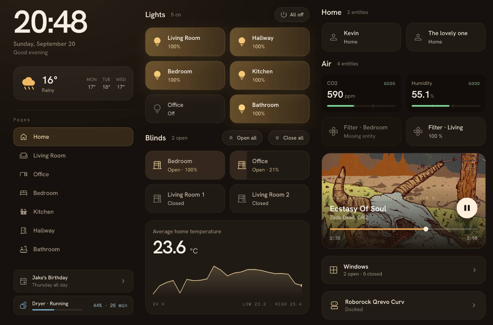

# Hearth

Hearth is a Home Assistant dashboard for wall tablets, phones and desktops. It brings your rooms, devices and daily information into a configurable interface with a visual editor, responsive layouts and day/night themes.

Hearth is an early-stage project and is actively evolving.



## Run locally

Requirements: Node.js 22 or newer and pnpm 10 or newer.

```sh
git clone https://github.com/knowald/ha-hearth.git
cd ha-hearth
pnpm install --frozen-lockfile
cp .env.example .env
pnpm dev
```

Set `HASS_URL` in `.env` to your Home Assistant URL, then open the address printed by Vite. Sign in through Home Assistant. The companion app can use a long-lived access token created in your Home Assistant profile.

For a production Node deployment:

```sh
pnpm build
HASS_URL=http://homeassistant.local:8123 PORT=5050 node server.js
```

The first connection opens a setup wizard that proposes a dashboard using Home Assistant's areas, devices and entities. You can also start with an empty page and add cards and rail widgets yourself.

## Docker

Build and run the project from this checkout:

```sh
cp .env.docker.example .env.docker
# Set HASS_URL in .env.docker before starting.
docker compose --env-file .env.docker up -d --build
```

The container listens on port 5050 and stores configuration under `/app/data`. Compose mounts `./data` by default; `DATA_PATH` changes that location. Use `docker compose logs` to inspect server logs.

The publishing workflow targets `ghcr.io/knowald/ha-hearth` when a release is published. Local builds do not depend on an image already existing in the registry.

## Configuration

- `data/hearth.yaml`: pages, cards, rail widgets, themes and tablet settings.
- `data/configuration.yaml`: language, motion, touch feedback, optional access token and custom JavaScript setting.
- `data/hearth-themes/`: saved Hearth theme presets.
- `data/backups/`: the ten most recent revisions of each saved configuration document.

Persisted dashboard documents declare `version: 5`. Other versions are rejected with a visible load error; they are not automatically converted. A failed load locks dashboard editing to protect the source file. Save requests must include the revision that the client loaded. Conflicts require an explicit choice in the editor.

Custom CSS and opt-in JavaScript are available through application settings. Use `--h-*` tokens for styling. Keep the data directory private: it may contain an access token. Serve Hearth behind your trusted network or authenticated reverse proxy; it does not provide a separate user authentication system for configuration endpoints.

## Interface

Hearth is served at `/`. `?room=<id>` opens a page, `?theme=<preset>` previews a built-in theme and `?menu=false` hides the edit button. These are presentation options, not access controls.

Cards cover entities, headers, sensors, media, vacuums, cameras, images, climate, scenes, elapsed days and conditional media. Rail widgets include clocks, weather, navigation, search, energy, progress, calendars, status, entities, charts, templates, timers, notifications and web pages.

Camera playback supports HLS and WebRTC with a still-image fallback. Calendar widgets show upcoming events. Entity domains without specialized controls use a generic state, attributes and history sheet. Picture-elements editing, calendar editing, todo editing and GPS maps are outside the current feature set.

Touch feedback is off by default and vibrates on presses, long presses, slider steps, saves and failed commands. It needs both a browser that implements the Vibration API and a secure origin: Chrome on Android over https or localhost works, and the same page over plain http does not vibrate at all even though the call reports success. Firefox for Android does not provide the API. iOS Safari 18 has no Vibration API either and is driven through a switch toggle instead, which the browser only honors during the gesture that triggered it.

## Development

```sh
pnpm check
pnpm lint
pnpm check:boundaries
pnpm check:style
pnpm check:hearth-a11y
pnpm test
pnpm build
pnpm check:bundle
pnpm test:e2e
pnpm matrix
```

Browser tests use a fake Home Assistant and fixture data. `pnpm matrix` generates screenshots and a review sheet. Actual device and live camera behavior also need testing against your installation.

See [component conventions](src/lib/Hearth/README.md) and [releasing](docs/release.md). Changes use the `hearth` commit scope. Contributions are covered by the [MIT license](LICENSE); retained copyright notices apply to included code.

## Shoutout

Hearth is a rework of [ha-fusion](https://github.com/matt8707/ha-fusion), originally created by matt8707. A big thank you to matt8707 for the project that made Hearth possible. You can also find a maintained continuation of the original project at [knowald/ha-fusion](https://github.com/knowald/ha-fusion).
